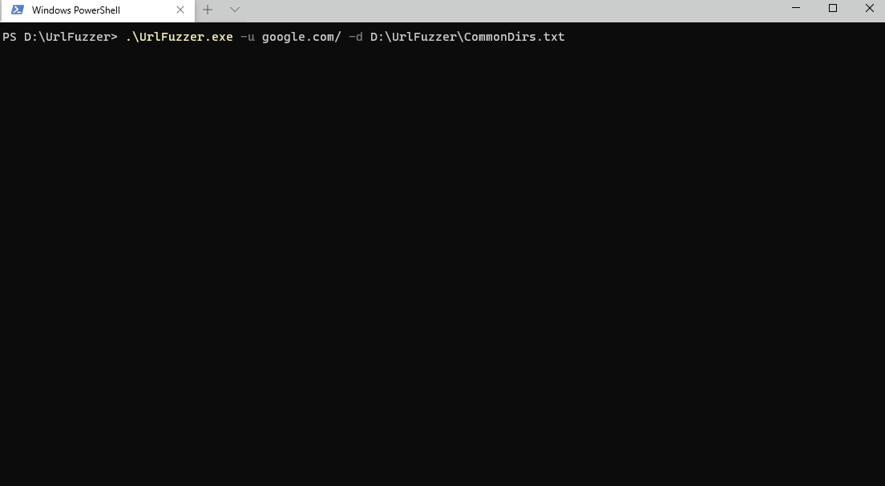

# C++ Url Fuzzer 💻
  
## ✨ Overview ✨
- Uses a wordlist to check for url directories
- Fast and eficient  

This is only a basic url fuzzer and wouldn't be practical to use.  
I made it a long time ago as practice so the syntax is probably awful. 


## Prerequisites

Uses CPR for the requests which can be found [here](https://github.com/whoshuu/cpr)  
### CPR can be downloaded using vcpkg like so:
```bash
git clone https://github.com/Microsoft/vcpkg.git
cd vcpkg
./bootstrap-vcpkg.sh
./vcpkg integrate install
./vcpkg install cpr
```

## Demo 🎥

Example argument: ``UrlFuzzer.exe -u google.com/ -d D:\UrlFuzzer\CommonDirs.txt``
### Gif Demo



## Author

- char*#1337 on discord
- mayhapsDev on GitHub

## 🤝 Contributing

Contributions, issues and feature requests are welcome!

Feel free to check 

## Show your support

Give a ⭐️ if this project helped you!

## Licence

MIT licence


## To-Do

- [ ] Add proxy support
- [ ] Add multithreading
